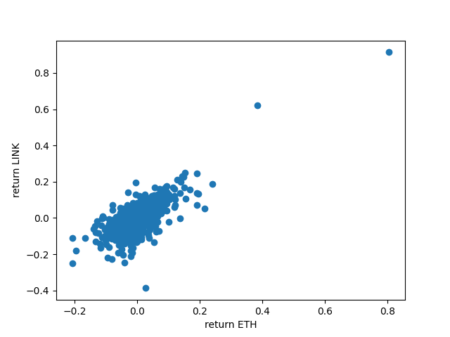
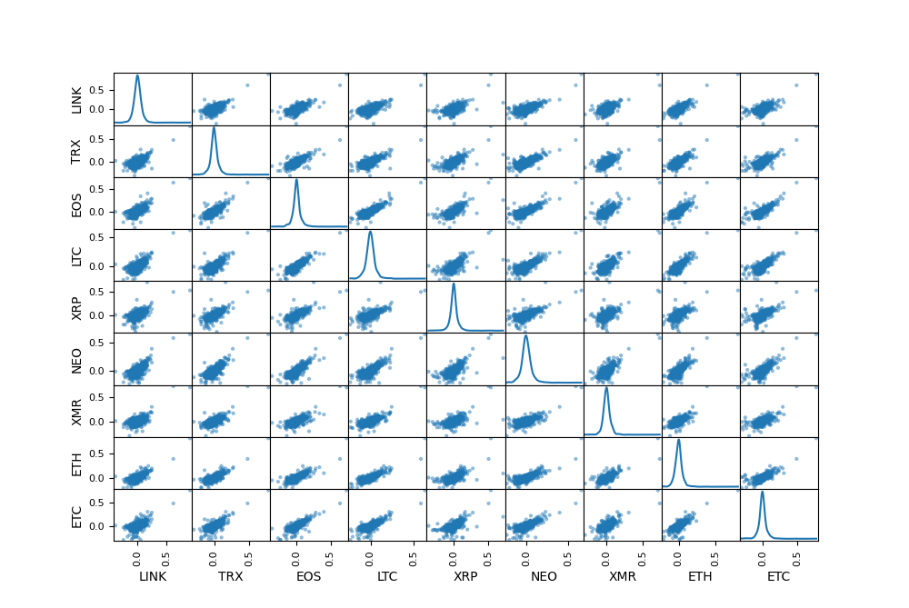
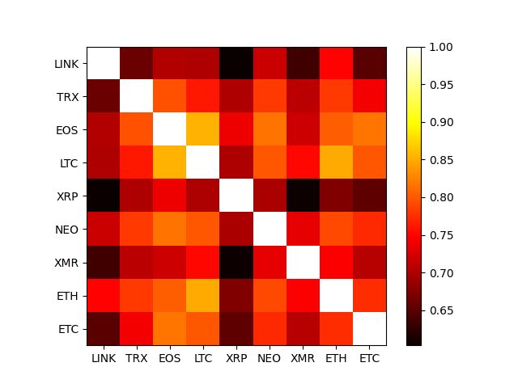

scraper.py -> 

data_preparation.py->
Download historical price data for each crypto from https://www.cryptodatadownload.com/data/binance/#google_vignette as csv file.

Transform data from :
    
 <table>
<tr><th> BTC/USDT </th><th> ETH/USDT</th></tr>
<tr><td>

unix  | symbol | date | close | ....|       
----  | ------ |----- |-----  | ----|   
..... | ....   | .... |....   | ....|
     
    
</td><td>

unix | symbol | date| close| 
---- | ----   |---- |----  |
.... | ....   |.... |....  |

</td></tr> </table> 

to

date  | BTC/USDT | ETH/USDT  | XRP/USDT  |  ..... |       
----- | -------  |------     |------     |  ----- | 
..... | ......   | ....      |......     |   .....|

where the columns are the closing price for each crypto

analysis.py -> Analysis with pandas 

Return distributions

<figure>
  

</figure>

Kernel Density Estimate

<figure>
  

</figure>

Heat maps

<figure>
  

</figure>
 